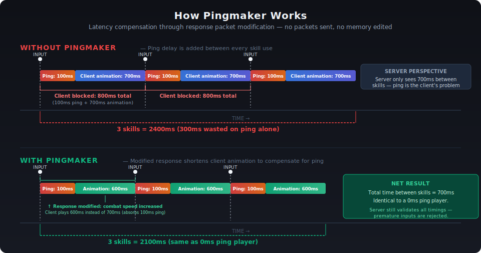

# Pingmaker

Latency compensation for Aion 2. Modifies inbound server response packets to adjust combat speed values, removing the artificial delay that ping adds between skill uses.

Compatible with **ExitLag**, **GearUp**, and other gaming proxies/VPNs.

## How It Works

When you use a skill, the server responds with a combat speed value (same as the stat ingame) that determines how long the player is locked out from sending the next skill. The problem is your ping gets added on top, so that a 100ms ping player waits 100ms longer between every skill than a 0ms player, even though the server would accept inputs earlier.

Pingmaker intercepts the response and increases the combat speed, shortening the client lockout to compensate. The server still validates all timings independently, and so players under 50ms never see any benefit. 

## Quick Start

Download `Pingmaker.exe` from [Releases](https://github.com/gunba/pingmaker/releases) and run as Administrator.

From source: `python pingmaker.py` (requires Windows 10/11, admin).

## Usage

1. The combat speed % maps to the same in-game stat. You can increase it (globally or per skill) until there is no improvement. 

2. For Skills with non-mobile flag (i.e. can't move while casting), increasing the combat speed beyond what is necessary will cause rubberbanding. 

3. **Varint cap:** Characters at ≤164% combat speed (usually sub-3k GS, no scroll) are capped at 164% due to 2-byte encoding (the packet does not have space for a larger number). Use the **Break Packet** checkbox on no-cooldown skills to bypass this — don't use it on skills with cooldowns, as it breaks cooldown tracking.

## Building

See [BUILD.md](BUILD.md).

## License

[MIT](LICENSE)
